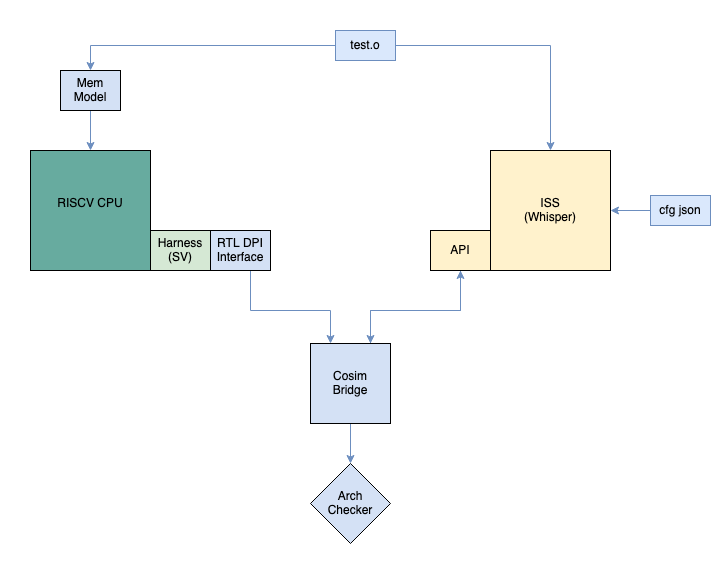

# cosim-arch-checker

Framework to perform DUT vs ISS (Whisper) lockstep architectural checks

## Overview
This repository contains the verification collateral needed to interface with a RISCV CPU core and perform lockstep architectural checks against the [Whisper](https://github.com/tenstorrent/whisper) RISCV CPU ISS. 

The main checks currently enabled are
- Integer register checks
- FP register checks
- Vector register checks

This has been verified using the [Boom core with Ocelot vector unit](https://github.com/tenstorrent/riscv-ocelot) inside [Chipyard](https://github.com/tenstorrent/chipyard) environment.



The main components involved here are
- DUT DPI interface
  - Send CPU arch state with SV to C++ function calls
- Whisper API interface
  - Step on instruction retire
  - Receive CPU arch state changes relative to previous step
- Bridge
  - Orchestrate DUT vs ISS arch state collection
  - Send DUT vs ISS arch state to CAC
- CAC (Core Arch Checker)
  - Compare DUT vs ISS arch state

## Directory Structure

```
|-- bin
|-- env
|-- mon
|   `-- mon_instr
|       |-- mon_instr_dpi.cc       -- DUT DPI interface
|-- bridge
|   `-- whisper
|       |-- config
|       |   `-- ocelot.json        -- Whisper config JSON
|       |-- whisper_client.cpp     -- Whisper API interface
|       `-- whisper_client.h
|-- cac
|-- README.md
```

## Usage
To use the DV collateral on a custom DUT, the following steps need to be followed:
- DUT interface
  - Set DUT specific config params in `env/params.h` 
  - Call the DUT DPI interface functions from tb top or harness
- Whisper API interface
  - Add DUT specific config json to `bridge/whisper/config` folder
- Include the build command `bazel build :dpi` in tb build system with these build-time options
  - `WHISPER_PATH=<path to whisper executable>`
  - `WHISPER_JSON=<path to whisper config>`
  - `TESTFILE=<path to test binary>`
  - `BOOTCODE=<path to bootrom binary>`
- Run the test with this run-time option: `+cosim`

### DUT config params
Example:
```
  const int k_NumHarts = 1;
  const int k_XLen = 64;
  const int k_VLen = 256;
```

### DUT DPI interface
```
void monitor_gpr(char *name, int hart, std::uint64_t cycle, std::uint32_t addr, std::uint64_t data);
void monitor_fpr(char *name, int hart, std::uint64_t cycle, std::uint32_t addr, std::uint64_t data);
void monitor_vr(char *name, int hart, std::uint64_t cycle, std::uint32_t addr, std::uint64_t *data);
void monitor_csr(char *name, int hart, std::uint64_t cycle, std::uint32_t addr, std::uint64_t data);
void monitor_retire(char *name, int hart, std::uint64_t cycle, std::uint64_t tag, std::uint64_t pc, std::uint64_t opcode, std::uint32_t trap);
```

### Whisper config json
Example:
https://yyz-gitlab.local.tenstorrent.com/manees/riscv-ocelot-cosim/-/blob/main/bridge/whisper/config/ocelot.json

## Sample output
From stdout log file:
```
Cosim whisper command: /path/to/whisper /path/to/elf /path/to/bootrom --harts 1 --raw --configfile /path/to/json --logfile iss_cosim.log --traceload  --server whisper_connect &
Whisper connect succeeded in 60 ms
<27> Whisper Step #0: [Hart=0, InstrTag=0x0, ChangeCount=1, PC=0x10040, Opcode=0x517, auipc    x10, 0x0]
<27> Whisper Step #0: [Hart=0, InstrTag=0x0, Resource=r, Addr=0xa, Data=0x10040]
Step: 0
                 X10                     DUT:[Data:0000000000010040]
                                         SIM:[Data:0000000000010040]
                  PC                     DUT:[Data:0000000000010040]
                                         SIM:[Data:0000000000010040]
<33> Whisper Step #1: [Hart=0, InstrTag=0x1, ChangeCount=1, PC=0x10044, Opcode=0xfc050513, addi     x10, x10, -64]
<33> Whisper Step #1: [Hart=0, InstrTag=0x1, Resource=r, Addr=0xa, Data=0x10000]
Step: 1
                 X10                     DUT:[Data:0000000000010000]
                                         SIM:[Data:0000000000010000]
                  PC                     DUT:[Data:0000000000010044]
                                         SIM:[Data:0000000000010044]
```

## Integration with Boom core with Ocelot vector in Chipyard 

Chipyard repo: https://github.com/tenstorrent/chipyard

### Build 
```
bazel build :dpi --copt=-DCONFIG=MediumBoomVecConfig

# The DUT params in params.h are set based on the CONFIG option
```

### Run
```
make -C sims/vcs/ run-binary-debug-hex CONFIG=MediumBoomVecConfig BINARY=/path/to/elf SIM_FLAGS="+cosim"

# Optional runtime options
#   +harness_tracer (default: OFF)
#   +dutmon_tracer (default: OFF)
#   +bridge_tracer (default: ON)
```
